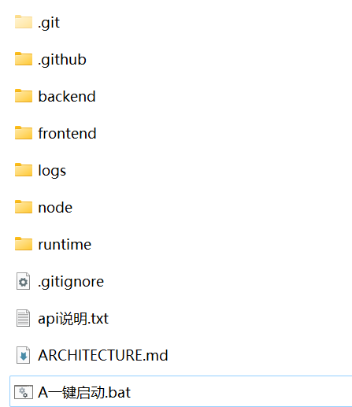

# 🌾 原始平原模拟 | Plains Simulation

<div align="center">

**一个基于AI驱动的2D像素风格NPC生存模拟游戏**

[](https://www.python.org/)
[](https://fastapi.tiangolo.com/)
[](https://reactjs.org/)
[](https://www.typescriptlang.org/)
[](https://pixijs.com/)
[](LICENSE)

</div>

---

## 📖 项目简介

原始平原模拟是一个创新的AI驱动生存模拟游戏，NPC使用大语言模型（DeepSeek）进行完全自主的决策。游戏模拟了一群原始人在荒野中的生存过程，他们会自主采集资源、建造房屋、制作工具、狩猎野兽、社交互动，甚至形成复杂的社会关系。

【作者注：以下内容都是AI写的，我也不知道它在说什么，最简单的启动方式：下载一键启动包，直接执行一键启动.bat脚本即可。】  
【一键启动包已内置python和nodejs环境，无需额外配置】  

## 文件目录结构：
runtime 放置python环境，也可以直接执行python脚本  
node 放置nodejs的独立运行包，可在官网下载  
[]
### ✨ 核心特点

- 🤖 **AI驱动决策**：每个NPC使用大语言模型进行独立思考和决策
- 🎭 **独特性格系统**：每个NPC拥有独特的性格特质（勇敢、社交、谨慎等）
- 🧠 **记忆与学习**：NPC会记住发生的事件，并基于记忆做出决策
- 🏗️ **建造系统**：从篝火到木屋，逐步建立聚居地
- 🔨 **制作系统**：制作工具、武器来提高生存效率
- 🌍 **动态世界**：实时天气、昼夜循环、资源再生
- 💬 **社交互动**：NPC之间会交流、合作、建立关系
- 🎮 **上帝模式**：玩家可以干预世界，影响NPC记忆和行为
- 📊 **实时可视化**：基于PixiJS的2D渲染，流畅的动画效果

---

## 🛠️ 技术栈

### 后端
| 技术 | 版本 | 用途 |
|------|------|------|
| **Python** | 3.11+ | 主要编程语言 |
| **FastAPI** | 0.104.1 | Web框架，提供RESTful API |
| **Python-SocketIO** | 5.10.0 | WebSocket实时通信 |
| **OpenAI SDK** | 1.3.5 | AI决策（DeepSeek API） |
| **Pydantic** | 2.5.0 | 数据验证和模型 |
| **Uvicorn** | 0.24.0 | ASGI服务器 |
| **Redis** | 5.0.1 | （可选）缓存和持久化 |

### 前端
| 技术 | 版本 | 用途 |
|------|------|------|
| **React** | 18.2.0 | UI框架 |
| **TypeScript** | 5.2.2 | 类型安全 |
| **PixiJS** | 7.3.2 | 2D WebGL渲染引擎 |
| **Zustand** | 4.4.7 | 轻量级状态管理 |
| **Socket.IO Client** | 4.6.1 | WebSocket客户端 |
| **Ant Design** | 5.12.2 | UI组件库 |
| **Vite** | 5.0.8 | 构建工具 |
| **Axios** | 1.6.2 | HTTP客户端 |

---

## 🎮 核心功能

### 1. NPC AI决策系统
- 每个NPC拥有独立的AI决策能力
- 基于当前状态（健康、饥饿、体力）和周围环境做出决策
- 考虑自身性格特质和技能水平
- 记住过去的经验，避免重复错误

### 2. 生存需求管理
- **健康值**：受伤、饥饿会降低，休息和进食恢复
- **饥饿值**：随时间增加，需要进食浆果或肉类
- **体力值**：行动消耗，休息恢复
- **体温**：受天气和建筑影响

### 3. 资源系统
- **木材**：砍伐树木获得，用于建造和制作
- **石头**：采集石头节点，用于工具和建筑
- **浆果**：采集浆果丛，用于食物
- **水源**：在水源处获取，维持生存
- **肉类**：狩猎野兽获得，高效食物来源

### 4. 建筑系统
| 建筑 | 需求 | 功能 |
|------|------|------|
| 篝火 | 5木材 | 提供光源和温暖，可烹饪食物 |
| 简易棚屋 | 10木材 + 5石头 | 基础庇护所，加速恢复 |
| 木屋 | 30木材 + 15石头 | 高级住所，大幅恢复状态 |
| 储物棚 | 20木材 | 存储资源，团队共享 |
| 工作台 | 15木材 + 10石头 | 解锁高级制作配方 |

### 5. 制作系统
| 物品 | 材料 | 效果 |
|------|------|------|
| 石斧 | 3石头 + 2木材 | 采集木材效率+50% |
| 石镐 | 4石头 + 2木材 | 采集石头效率+50% |
| 长矛 | 2石头 + 3木材 | 战斗伤害+30% |
| 篮子 | 5木材 | 采集浆果效率+30% |
| 水容器 | 3木材 | 储存更多水 |

### 6. 技能系统
NPC通过执行行动提升相关技能（0-100级）：
- **伐木** (Woodcutting)
- **采矿** (Mining)
- **觅食** (Foraging)
- **战斗** (Combat)
- **建造** (Construction)
- **制作** (Crafting)
- **社交** (Social)
- **生存** (Survival)

### 7. 性格系统
每个NPC拥有6个性格特质（0-100），影响决策：
- **勇敢度** - 影响战斗和探索意愿
- **社交性** - 影响与他人交流频率
- **谨慎度** - 影响风险评估
- **好奇心** - 影响探索新区域意愿
- **合作性** - 影响团队协作意愿
- **进取心** - 影响学习和提升动力

### 8. 社交系统
- NPC之间可以交流对话
- 共同执行需要合作的建筑任务
- 建立关系网络（好感度 -100 到 +100）
- 分享资源和工具

### 9. 上帝指令系统
玩家作为"上帝"可以：
- 为NPC添加记忆
- 修改NPC的特定记忆
- 清除NPC的记忆
- 影响游戏进程

---

## 🚀 快速开始

### 💎 方法一：懒人包启动（强烈推荐！）

**零安装，开箱即用！** 无需安装Python和Node.js！

#### Windows
```bash
# 双击运行
一键启动.bat
```

**特点**：
- ✅ **完全独立** - 自带Python和Node.js环境
- ✅ **零配置** - 解压即用，无需任何安装
- ✅ **适合分享** - 可以直接打包发给朋友

**内置环境**：
- Python 3.11（`runtime/` 目录）
- Node.js 18+（`node/` 目录）
- 所有依赖已预装

> 💡 **首次运行**需要安装前端依赖（约2-5分钟），之后启动只需几秒！
>
> 📖 详细说明请查看：[PORTABLE_GUIDE.md](PORTABLE_GUIDE.md)

---

### 🛠️ 方法二：开发者模式

**适合有Python和Node.js环境的开发者**

#### 前置要求
- **Python 3.11+**
- **Node.js 18+**
- **DeepSeek API Key**（或其他OpenAI兼容的API）

#### Windows
```bash
# 使用系统环境
start_game.bat
```

#### Linux/Mac
```bash
chmod +x start_game.sh
./start_game.sh
```

---

### 🔧 方法三：手动启动（完全控制）

#### 1. 配置环境变量

在 `backend/` 目录创建 `.env` 文件：

```bash
DEEPSEEK_API_KEY=your_api_key_here
DEEPSEEK_BASE_URL=https://api.deepseek.com
PORT=8000
```

#### 2. 启动后端

```bash
# 进入后端目录
cd backend

# 创建虚拟环境（首次运行）
python -m venv venv

# 激活虚拟环境
# Windows
venv\Scripts\activate
# Linux/Mac
source venv/bin/activate

# 安装依赖（首次运行）
pip install -r requirements.txt

# 启动服务器
python run.py
```

后端启动成功后，访问：
- API文档：http://localhost:8000/docs
- 健康检查：http://localhost:8000/api/health

#### 3. 启动前端

**新开一个终端窗口**：

```bash
# 进入前端目录
cd frontend

# 安装依赖（首次运行）
npm install

# 启动开发服务器
npm run dev
```

前端启动成功后，访问：http://localhost:5173

### 🎯 开始游戏

1. 打开浏览器访问 http://localhost:5173
2. 等待5个NPC在平原中心出生
3. 观察NPC自主行动、采集、建造
4. 点击NPC查看详细信息和AI思考过程
5. 使用右下角的上帝控制台干预世界

---

## 📁 项目结构

```
模拟像素/
├── backend/                    # Python后端
│   ├── app/
│   │   ├── models/            # 数据模型
│   │   │   ├── npc.py        # NPC模型
│   │   │   ├── world.py      # 世界状态
│   │   │   ├── actions.py    # 行动类型
│   │   │   ├── buildings.py  # 建筑系统
│   │   │   ├── crafting.py   # 制作系统
│   │   │   ├── resources.py  # 资源节点
│   │   │   ├── beasts.py     # 野兽系统
│   │   │   └── conversation.py # 对话系统
│   │   ├── services/          # 核心服务
│   │   │   ├── ai_service.py        # AI决策服务
│   │   │   ├── game_loop.py         # 游戏主循环
│   │   │   ├── world_generator.py   # 世界生成
│   │   │   ├── memory_service.py    # 记忆管理
│   │   │   └── physics_engine.py    # 物理引擎
│   │   ├── prompts/           # AI提示词
│   │   │   └── npc_decision_prompt.py
│   │   └── main.py           # FastAPI应用入口
│   ├── requirements.txt       # Python依赖
│   ├── run.py                # 启动脚本
│   └── .env                  # 环境变量
├── frontend/                  # React前端
│   ├── src/
│   │   ├── components/       # React组件
│   │   │   ├── GameCanvas.tsx      # 游戏画布（PixiJS）
│   │   │   ├── EventTimeline.tsx   # 事件时间线
│   │   │   ├── NPCPanel.tsx        # NPC信息面板
│   │   │   ├── TopBar.tsx          # 顶部状态栏
│   │   │   ├── ObjectInfoPanel.tsx # 对象信息面板
│   │   │   └── GodConsole.tsx      # 上帝控制台
│   │   ├── store/
│   │   │   └── gameStore.ts        # Zustand状态管理
│   │   ├── services/
│   │   │   └── socketService.ts    # WebSocket服务
│   │   ├── types/
│   │   │   └── index.ts           # TypeScript类型定义
│   │   ├── App.tsx           # 根组件
│   │   └── main.tsx          # 入口文件
│   ├── package.json          # Node依赖
│   └── vite.config.ts        # Vite配置
├── logs/                     # 日志目录
│   └── npc_decisions/       # NPC决策日志
├── start_game.bat           # Windows启动脚本
├── start_game.sh            # Linux/Mac启动脚本
├── START.md                 # 启动指南
└── README.md                # 本文件
```

---

## 🔌 API文档

### REST API

#### 基础端点
- `GET /` - 根端点，返回API信息
- `GET /api/health` - 健康检查
- `GET /api/world` - 获取完整世界状态
- `GET /api/npcs` - 获取所有NPC列表
- `GET /api/npcs/{npc_id}` - 获取特定NPC详情和记忆
- `GET /api/resources` - 获取所有资源节点
- `GET /api/buildings` - 获取所有建筑
- `GET /api/events` - 获取最近50个游戏事件

### WebSocket事件

#### 客户端监听（从服务器接收）

```typescript
// 完整世界状态（连接时发送）
socket.on('world_state', (data: WorldState) => {})

// 世界增量更新（每帧发送）
socket.on('world_update', (data: Partial<WorldState>) => {})

// NPC行动事件
socket.on('npc_action', (data: {
  npc_id: string,
  action: string,
  description: string
}) => {})

// 游戏事件
socket.on('game_event', (data: GameEvent) => {})

// 上帝指令执行结果
socket.on('god_command_result', (data: {
  success: boolean,
  message: string
}) => {})
```

#### 客户端发送（到服务器）

```typescript
// 客户端准备就绪
socket.emit('client_ready')

// 请求世界状态
socket.emit('request_world_state')

// 上帝指令：添加记忆
socket.emit('god_add_memory', {
  target: 'all' | npc_id,
  memory: string
})

// 上帝指令：修改记忆
socket.emit('god_modify_memory', {
  npc: npc_id,
  index: number,
  new_memory: string
})

// 上帝指令：清除记忆
socket.emit('god_clear_memories', {
  target: 'all' | npc_id
})
```

---

## 🧑‍💻 开发指南

### 添加新的NPC行动类型

1. **定义行动类型**

在 `backend/app/models/actions.py` 添加新行动：

```python
class ActionType:
    # ... 现有行动
    MY_NEW_ACTION = "my_new_action"
```

2. **更新提示词**

在 `backend/app/prompts/npc_decision_prompt.py` 添加到可用行动列表：

```python
available_actions.append({
    "action": "my_new_action",
    "description": "描述这个行动",
    "when_to_use": "什么时候使用"
})
```

3. **实现行动逻辑**

在 `backend/app/services/game_loop.py` 的 `execute_action()` 方法中添加处理：

```python
async def execute_action(self, npc: NPC2D, action: NPCAction):
    # ... 现有代码
    elif action.action == ActionType.MY_NEW_ACTION:
        # 实现你的行动逻辑
        self.log_event(f"{npc.name}执行了新行动", importance="low")
```

### 添加新的建筑类型

在 `backend/app/models/buildings.py` 添加：

```python
class BuildingType:
    MY_BUILDING = {
        "id": "my_building",
        "name": "我的建筑",
        "description": "建筑描述",
        "requirements": {"wood": 10, "stone": 5},
        "build_time": 120.0,
        "size": {"x": 2, "y": 2},
        "sprite": "my_building",
        "requires_cooperation": False
    }
```

### 添加新的制作配方

在 `backend/app/models/crafting.py` 添加：

```python
CRAFTING_RECIPES = {
    # ... 现有配方
    "my_item": CraftingRecipe(
        item_name="my_item",
        required_materials={"wood": 5, "stone": 3},
        crafting_time=20.0,
        skill_required="crafting",
        skill_level=10,
        tool_type="tool",
        durability=100,
        description="我的物品描述"
    )
}
```

### 修改AI模型参数

在 `backend/app/services/ai_service.py` 调整：

```python
response = self.client.chat.completions.create(
    model="deepseek-chat",  # 更改模型
    temperature=0.8,         # 调整创造性 (0.0-1.0)
    max_tokens=500          # 最大响应长度
)
```

### 自定义前端组件

1. 在 `frontend/src/components/` 创建新组件
2. 使用 `useGameStore()` 访问全局状态
3. 在 `App.tsx` 中引入并使用

```tsx
import { useGameStore } from '../store/gameStore'

export function MyComponent() {
  const { npcs, world } = useGameStore()
  
  return (
    <div>
      {/* 你的组件内容 */}
    </div>
  )
}
```

---

## 🐛 调试与日志

### 后端日志

- **控制台日志**：直接在运行后端的终端查看
- **NPC决策日志**：`backend/logs/npc_decisions/` 目录下，每个NPC一个文件

### 前端日志

- 打开浏览器开发者工具（F12）
- 查看Console标签页
- WebSocket消息在Network标签的WS筛选器中

### 常见问题排查

#### NPC不动/无响应
1. 检查后端是否正常运行
2. 查看浏览器Console是否有WebSocket连接错误
3. 检查DeepSeek API密钥是否有效
4. 查看后端日志是否有AI调用失败

#### 前端显示"未连接"
1. 确保后端在 http://localhost:8000 运行
2. 检查CORS配置
3. 刷新页面重新连接

#### AI决策很慢
- 这是正常的，AI调用需要时间（通常2-5秒）
- 可以降低NPC数量或增加决策冷却时间

---

## 🎨 自定义与扩展

### 修改游戏参数

在 `backend/app/main.py` 的 `startup_event()` 中：

```python
config = GameConfig(
    map_width=100,           # 地图宽度
    map_height=100,          # 地图高度
    initial_npc_count=5,     # 初始NPC数量
    time_scale=60.0          # 时间缩放（1游戏分钟=60实时秒）
)
```

### 调整资源生成

在 `backend/app/services/world_generator.py` 中修改资源密度和分布。

### 更换AI提供商

支持任何OpenAI兼容的API：

```python
# .env 文件
DEEPSEEK_API_KEY=your_api_key
DEEPSEEK_BASE_URL=https://api.your-provider.com
```

支持的提供商：
- DeepSeek
- OpenAI
- Azure OpenAI
- 本地部署的模型（如LLaMA、Qwen等）

---

## 🤝 贡献指南

我们欢迎所有形式的贡献！

### 如何贡献

1. **Fork** 本仓库
2. 创建特性分支 (`git checkout -b feature/AmazingFeature`)
3. 提交更改 (`git commit -m 'Add some AmazingFeature'`)
4. 推送到分支 (`git push origin feature/AmazingFeature`)
5. 开启 **Pull Request**

### 贡献方向

- 🆕 新功能：新的NPC行动、建筑、物品
- 🎨 UI优化：改进前端界面和交互
- 🐛 Bug修复：修复已知问题
- 📝 文档：改进文档和注释
- 🧪 测试：添加单元测试和集成测试
- 🌍 国际化：添加多语言支持
- 🎮 游戏平衡：调整参数使游戏更有趣

### 代码规范

- **Python**：遵循 PEP 8
- **TypeScript**：遵循 ESLint 配置
- **提交信息**：使用清晰的描述性消息
- **文档**：为新功能添加注释和文档

---

## 📋 待办事项与路线图

### 当前版本 (v1.0)
- [x] 基础NPC AI决策系统
- [x] 资源采集和管理
- [x] 建筑建造系统
- [x] 制作系统
- [x] 社交和对话
- [x] 技能和性格系统
- [x] 上帝指令系统
- [x] 实时可视化

### 未来计划 (v1.1+)
- [ ] 持久化存储（保存/加载游戏）
- [ ] 更多建筑类型（农田、围墙、瞭望塔）
- [ ] 农业系统（种植、收获）
- [ ] 更复杂的野兽AI
- [ ] 天气系统影响游戏玩法
- [ ] 疾病和医疗系统
- [ ] 贸易系统
- [ ] 多个聚居地和部落
- [ ] 地图编辑器
- [ ] 移动端适配

---

## 📊 性能优化

### 已实现的优化
- PixiJS WebGL渲染，高性能2D图形
- WebSocket仅传输增量更新，减少带宽
- React组件使用 `useMemo` 和 `useCallback` 优化
- AI决策结果缓存
- 事件日志限制数量，防止内存泄漏

### 性能指标
- **前端FPS**：60 FPS（PixiJS渲染）
- **WebSocket延迟**：< 50ms
- **AI决策时间**：2-5秒（取决于API响应）
- **支持NPC数量**：测试过20个NPC同时运行

---

## 📄 许可证

本项目采用 **MIT License** 开源。

```
MIT License

Copyright (c) 2024 原始平原模拟

Permission is hereby granted, free of charge, to any person obtaining a copy
of this software and associated documentation files (the "Software"), to deal
in the Software without restriction, including without limitation the rights
to use, copy, modify, merge, publish, distribute, sublicense, and/or sell
copies of the Software, and to permit persons to whom the Software is
furnished to do so, subject to the following conditions:

The above copyright notice and this permission notice shall be included in all
copies or substantial portions of the Software.

THE SOFTWARE IS PROVIDED "AS IS", WITHOUT WARRANTY OF ANY KIND, EXPRESS OR
IMPLIED, INCLUDING BUT NOT LIMITED TO THE WARRANTIES OF MERCHANTABILITY,
FITNESS FOR A PARTICULAR PURPOSE AND NONINFRINGEMENT. IN NO EVENT SHALL THE
AUTHORS OR COPYRIGHT HOLDERS BE LIABLE FOR ANY CLAIM, DAMAGES OR OTHER
LIABILITY, WHETHER IN AN ACTION OF CONTRACT, TORT OR OTHERWISE, ARISING FROM,
OUT OF OR IN CONNECTION WITH THE SOFTWARE OR THE USE OR OTHER DEALINGS IN THE
SOFTWARE.
```

---

## 🙏 致谢

- **[FastAPI](https://fastapi.tiangolo.com/)** - 优秀的Python Web框架
- **[PixiJS](https://pixijs.com/)** - 强大的2D渲染引擎
- **[DeepSeek](https://www.deepseek.com/)** - 提供AI决策能力
- **[React](https://reactjs.org/)** - 前端UI框架
- **[Zustand](https://github.com/pmndrs/zustand)** - 轻量级状态管理

---

## 📧 联系方式

- **问题反馈**：通过GitHub Issues提交
- **功能建议**：通过GitHub Discussions讨论
- **贡献代码**：通过Pull Request提交

---

## 🌟 支持项目

如果你觉得这个项目有趣，请给我们一个 ⭐️ Star！

你也可以：
- 分享给朋友
- 提交Bug报告
- 贡献代码
- 改进文档
- 提供反馈和建议

---

<div align="center">

**用AI创造生命，用代码模拟世界** 🌍✨

Made with ❤️ by the Plains Simulation Team

</div>

